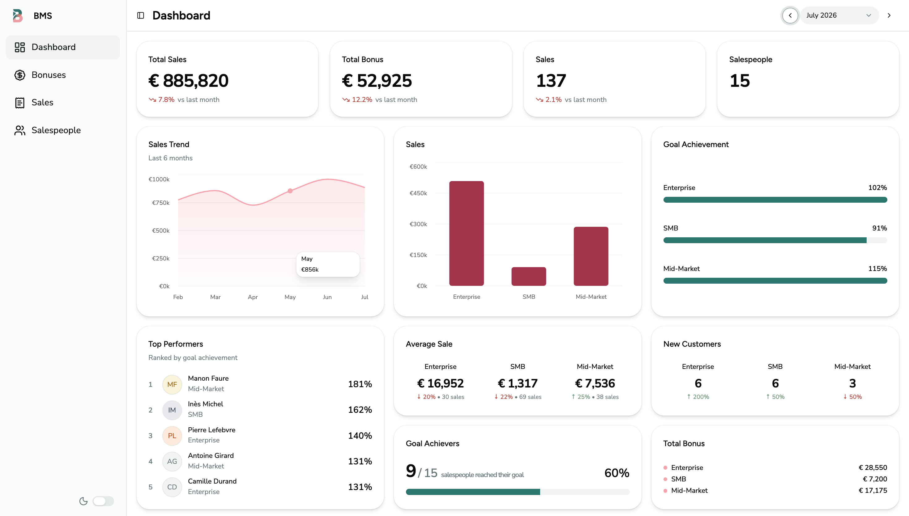
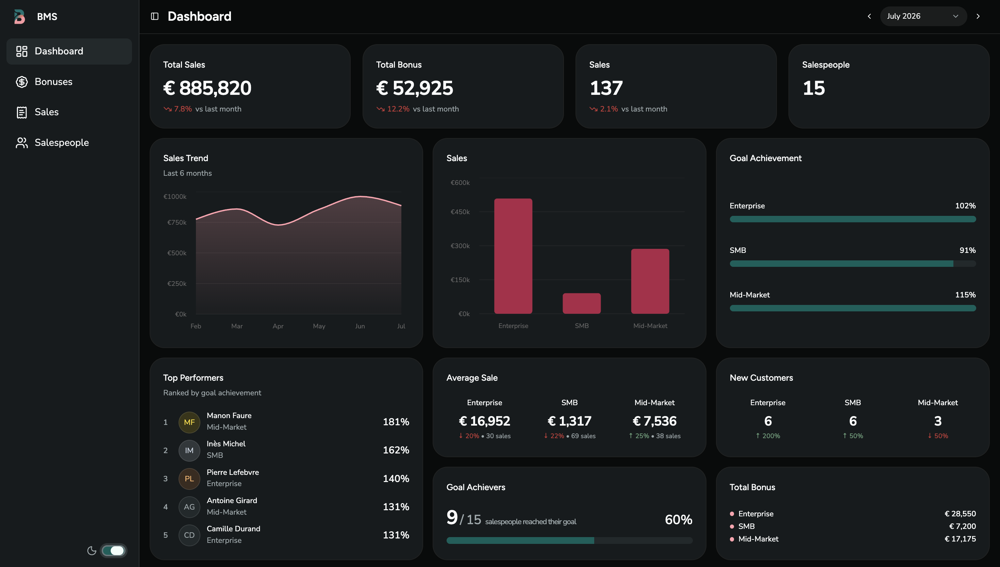
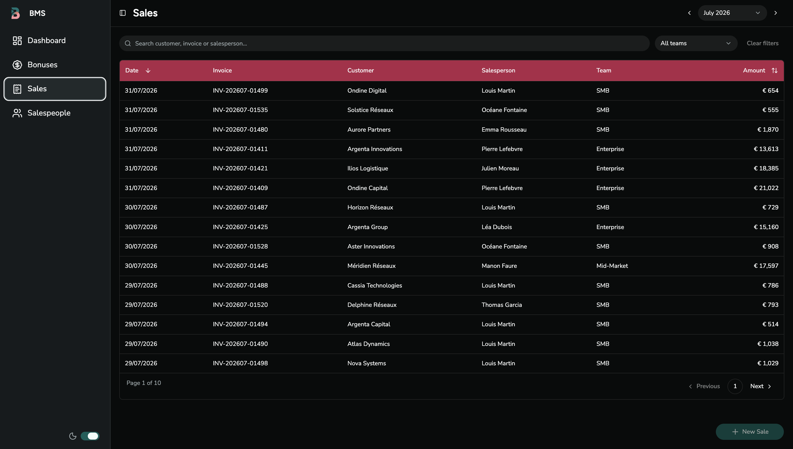
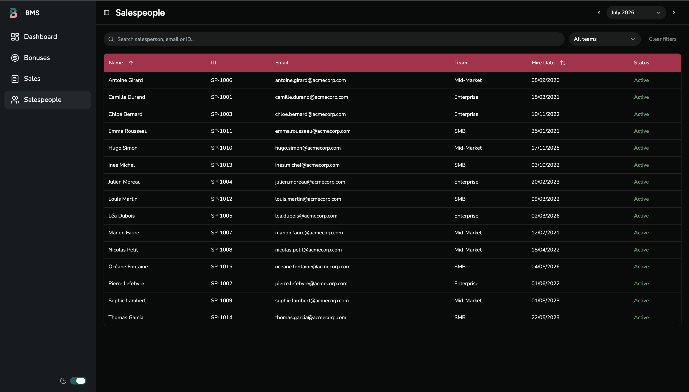
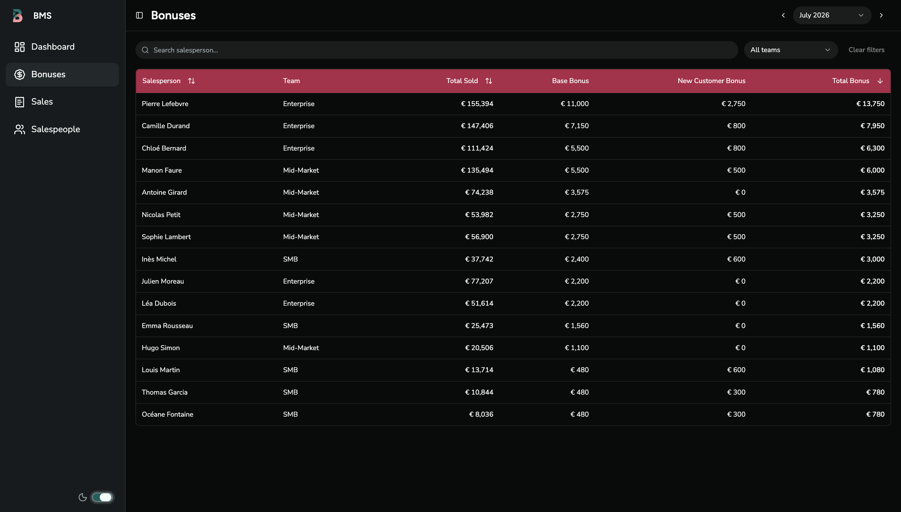
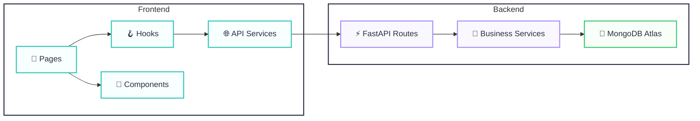

# Bonus Management System


A full-stack web application for managing sales performance, calculating bonuses, and visualizing business metrics.

This project simulates a real-world sales organization with different sales teams, configurable bonus rules, interactive dashboards, and realistic business data. It was built to showcase modern full-stack development practices using React, FastAPI, and MongoDB.

## Overview

Bonus Management System is a fictional enterprise application designed to support the Finance department in managing sales performance, calculating monthly bonuses, and monitoring company-wide sales metrics.

The current implementation represents the Finance workspace, providing visibility into sales activity, salespeople performance, and bonus calculations.

The platform is designed to evolve into a multi-role system supporting Finance, Sales Managers, and Sales Representatives through dedicated workspaces and permission-based access.

---

## Live Demo

- **Frontend:** https://your-demo-url.com
- **API Documentation:** https://your-api-url.com/docs

---

## Preview

### Dashboard




---

### Sales



---

### Salespeople



---

### Bonuses



---

## Features

### 📊 Analytics

- Interactive dashboard
- KPIs
- Monthly trends
- Performance analytics

### 💼 Sales

- Sales management
- Search
- Filtering
- Server-side pagination
- Sorting

### 👥 Salespeople

- Salespeople management

### 💰 Bonuses

- Monthly bonus calculation
- Configurable business rules

### 🎨 User Experience

- Responsive interface
- Dark mode

## Business Rules

The application simulates a sales organization composed of three independent sales teams.

| Team | Monthly Goal |
|-------|-------------:|
| Enterprise | $100,000 |
| Mid-Market | $50,000 |
| SMB | $20,000 |

Monthly bonuses are calculated according to:

- Goal achievement
- Sales team
- Number of new customers acquired

Each team has:

- Different monthly goals
- Different target bonuses
- Different incentives for new customers

To keep payouts balanced, new customer bonuses are capped so they cannot outweigh base performance.

---

## Tech Stack

| Frontend | Backend | Tooling |
|----------|----------|----------|
| ⚛️ React | ⚡ FastAPI | 🧹 Ruff |
| 🔷 TypeScript | 🍃 MongoDB Atlas | ✨ ESLint |
| ⚡ Vite | 🚀 Motor | 🎯 Prettier |
| 🎨 Tailwind CSS | ✅ Pydantic | |
| 🧩 shadcn/ui | | |
| 📦 TanStack Query | | |
| 📋 TanStack Table | | |
| 🛣️ React Router | | |
| 📈 Recharts | | |

---

## Architecture



---

## Design Principles

The project follows a layered architecture that separates presentation, business logic, and data access.

### Frontend

- Feature-based components
- Reusable UI components
- Server state managed with TanStack Query
- Shared providers for application state
- Type-safe API integration
- Shared utility libraries

### Backend

- Thin API layer
- Business logic isolated in services
- Pydantic schemas for validation
- MongoDB as the persistence layer

## API

| Method | Endpoint | Description |
|--------|----------|-------------|
| GET | `/dashboard` | Retrieve dashboard metrics |
| GET | `/sales` | List sales |
| POST | `/sales` | Create a sale |
| PATCH | `/sales/{sale_id}` | Update a sale |
| GET | `/salespeople` | List salespeople |
| GET | `/bonuses` | Calculate and list monthly bonuses |
| GET | `/docs` | Interactive OpenAPI (Swagger UI) documentation |


---

## Project Structure

```text
bonus-management-system/
│
├── backend/
│   ├── app/
│   │   ├── api/           # FastAPI route handlers
│   │   ├── database/      # MongoDB client
│   │   ├── schemas/       # Pydantic models
│   │   ├── scripts/       # Database seed
│   │   ├── services/      # Business logic
│   │   ├── config.py
│   │   └── main.py
│   │
│   └── requirements.txt
│
├── frontend/
│   ├── public/
│   └── src/
│       ├── components/    # UI and feature components
│       ├── constants/     # Shared constants
│       ├── hooks/         # Custom React hooks
│       ├── lib/           # Utilities and formatters
│       ├── pages/         # Application pages
│       ├── providers/     # React context providers
│       ├── router/        # Application routing
│       ├── services/      # API clients
│       └── types/         # TypeScript models
│
├── screenshots/
└── README.md
```

---

## Running Locally

Clone the repository:

```bash
git clone https://github.com/btoranza/bonus_management_system.git

cd bonus-management-system
```

### Backend

```bash
cd backend

uv sync

uv run fastapi dev app/main.py
```

### Frontend

```bash
cd frontend

npm install

npm run dev
```

---

## Environment Variables

### Backend

```env
MONGODB_URI=<your-mongodb-atlas-uri>
```

### Frontend

```env
VITE_API_URL=http://localhost:8000
```

---

## Demo Data

The project includes a seed script that generates a realistic one-year dataset including:

- Salespeople
- Sales history
- Recurring customers
- New customer acquisition
- Monthly seasonality
- Team-specific performance
- Consistent salesperson profiles

The generated dataset is deterministic and designed to produce meaningful dashboards and bonus calculations.

Run:

```bash
python app/scripts/seed.py
```

---

## Highlights

This project focuses on building a realistic business application rather than a simple CRUD.

Implementation highlights include:

- Server-side pagination, filtering and sorting
- Reusable table infrastructure
- Modular bonus calculation service
- Interactive dashboard with business KPIs
- Responsive user interface
- Clean separation between presentation, business logic and data access
- Realistic demo dataset designed to produce meaningful analytics

---

## Roadmap

| Area | Feature | Short | Mid | Long |
|------|---------|:-----:|:---:|:----:|
| **Sales** | Create, edit and delete sales | ✅ | | |
| | Bulk sales import | ✅ | | |
| | CSV import/export | ✅ | | |
| **Salespeople** | Create and edit salespeople | ✅ | | |
| | Activate / deactivate salespeople | ✅ | | |
| **Bonuses** | Editable bonus rules | ✅ | | |
| | Bonus approval workflow | ✅ | | |
| | Bonus history | | ✅ | |
| **Users** | User authentication | | ✅ | |
| | Role-based access control | | ✅ | |
| **Workspaces** | Finance workspace | | ✅ | |
| | Sales Manager workspace | | ✅ | |
| | Sales Representative workspace | | ✅ | |
| **Analytics** | Team performance management | | ✅ | |
| | Personal dashboards | | ✅ | |
| **Platform** | Automated tests | | | ✅ |
| | Docker support | | | ✅ |
| | CI/CD pipeline | | | ✅ |
| | Monitoring & logging | | | ✅ |
| | Audit logs | | | ✅ |
| | Application Settings | | ✅ | |

---
